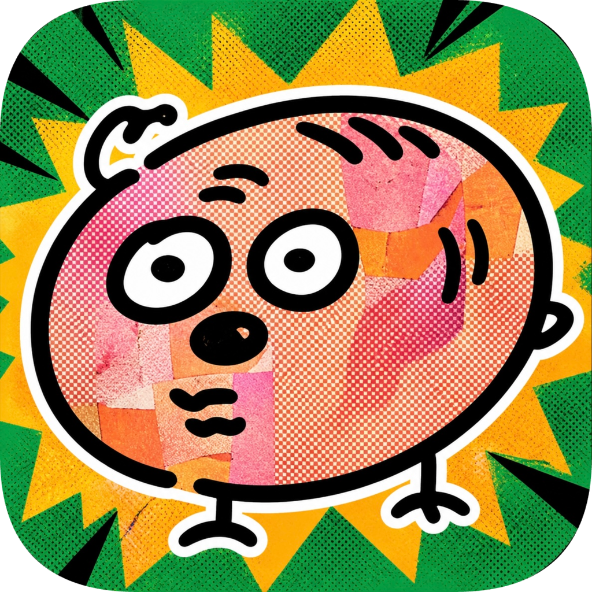

# 野猪乱打手枪 · Wild Pig Gun

[中文](#中文) · [English](#english)

---

## 中文

### 这是什么游戏？

《野猪乱打手枪》是一款用 **Godot 4** 制作的 **俯视角射击肉鸽（Roguelite）**：在竞技场里抵御一波波敌人，波次之间进入 **商店与构筑**，用掉落材料购买 **武器、数值强化与被动**，角色与成长路线由每局选择决定，单局内逐步变强，死亡后重新开始新一局。

### 核心玩法

- **波次生存**：敌人随关卡推进变强、种类增多（含远程、冲锋、护盾与 Boss 等）。
- **构筑**：升级与商店条目影响伤害、暴击、生命回复、元素（燃烧/冰冻减速/毒素/感电易伤等）。
- **多武器与近战**：可装备多种武器，配合穿透、霰弹等机制。
- **存档**：支持本机存档与部分局内进度记录（详见 `scripts/save/`）。

### 环境与运行

1. 安装 **[Godot 4.6](https://godotengine.org/download)**（与 `project.godot` 中 `config/features` 一致）。
2. 用 Godot **导入本仓库根目录**（含 `project.godot` 的文件夹）。
3. 点击编辑器 **运行（F5）**；主场景为 **主菜单**（`run/main_scene` 已配置）。

### 编译 / 导出

更完整的说明见 **[docs/EXPORT.md](docs/EXPORT.md)**。简要步骤：

| 目标 | 说明 |
|------|------|
| **桌面**（Windows / macOS / Linux） | 菜单 **项目 → 导出**，添加对应平台导出模板并导出。 |
| **Web** | 使用与引擎版本一致的 Web 导出模板；注意浏览器性能与包体大小。 |
| **Android** | 导出 APK/AAB；虚拟摇杆在 Android 上自动启用（见 `VirtualJoystick`）。 |

数据在运行时从 `res://data/*.json` 读取；修改 JSON 后需重新导出或随 PCK 发布。

### 仓库与许可

- 远程仓库：<https://github.com/ZhiH2333/Wild-Pig-Gun>  
- 许可证：见仓库内 `LICENSE`（与上游一致时请以其为准）。

### 发行与统计

- 1.0.0 发布说明：见 `release-notes/v1.0.0.md`
- Stars 曲线图：  
  

### 版权声明

- 代码许可证：MIT（`LICENSE`）。
- Copyright (c) 2026 ZhiH.
- 第三方资源请按各自来源与许可证要求使用与分发。

---

## English

### What is this?

**Wild Pig Gun** (*野猪乱打手枪*) is a **top-down shooter roguelite** built with **Godot 4**: survive arena **waves** of enemies, visit the **shop and build** between waves, spend materials on **weapons and stat upgrades**, and shape each run with character choices and on-the-run power growth. When you die, you start a **new run**.

### Core loop

- **Wave survival**: enemies scale and diversify (ranged, chargers, shielded foes, bosses, etc.).
- **Build variety**: upgrades and shop items affect damage, **crits**, HP regen, and **elements** (burn, slow, poison, shock vulnerability, etc.).
- **Weapons & melee**: multiple weapons, pierce, pellet spread, and more.
- **Save data**: local persistence (see `scripts/save/`).

### Requirements & run from source

1. Install **[Godot 4.6](https://godotengine.org/download)** (matches `config/features` in `project.godot`).
2. **Import** this repository root (the folder that contains `project.godot`) in the Godot project manager.
3. Press **Run (F5)** in the editor. The **main menu** is the entry scene.

### Build / export

See **[docs/EXPORT.md](docs/EXPORT.md)** for details. Short version:

| Target | Notes |
|--------|--------|
| **Desktop** (Windows / macOS / Linux) | **Project → Export**, add templates, export. |
| **Web** | Use Web export templates matching your engine build; test FPS and size in target browsers. |
| **Android** | Export APK/AAB; on-device **virtual joystick** is enabled when `OS.has_feature("android")`. |

Game data is loaded from `res://data/*.json`; after editing JSON, re-export or ship updated PCK.

### Repository & license

- GitHub: <https://github.com/ZhiH2333/Wild-Pig-Gun>  
- License: see `LICENSE` in this repository.

### Release & stats

- 1.0.0 release notes: `release-notes/v1.0.0.md`
- Star history chart:  
  

### Copyright

- Code license: MIT (`LICENSE`).
- Copyright (c) 2026 ZhiH.
- Please comply with third-party asset licenses before redistribution.
